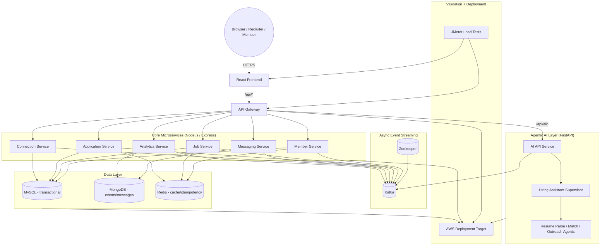

# LinkedIn Simulation (Data 236)

Distributed LinkedIn-style project with React frontend, API gateway, Node microservices, Kafka workers, MySQL, MongoDB, Redis, Agentic AI, and deployment/benchmarking readiness.

---

<!-- ====================== 0.0 SYSTEM ARCHITECTURE ====================== -->
## 0.0 System Architecture



---

<!-- ====================== 0.1 PORTS / GATEWAY / SWAGGER ====================== -->
## 0.1 Ports, gateway, and Swagger (read this to avoid confusion)

**This layout is intentional.**

| Port | What it is | You use it for |
|------|------------|----------------|
| **4000** | **API gateway** (single HTTP entry to the backend) | `POST /api/...`, **`http://localhost:4000/docs`** (Swagger — **served by the gateway**, not “moved” elsewhere) |
| **3000** | **React app** (Vite dev server) | **`http://localhost:3000`** for the UI. In dev, Vite **proxies** `/api` and `/docs` → `http://localhost:4000`, so **`http://localhost:3000/docs`** is the **same** Swagger document, just reached through the proxy for convenience (one browser origin). |
| **4001–4007** | Individual microservices behind the gateway | Normally **not** opened in the browser; traffic goes **via 4000** (or relative `/api/...` from the app on 3000). |

**Takeaways**

1. **Swagger always lives on the gateway process** (`/docs` on port **4000**). Port **3000** does not host a second copy; it only **forwards** `/docs` when you run `npm run dev` in `frontend/` (see `frontend/vite.config.ts`).
2. If someone says “use the app on3000,” that is correct for the **UI**. If they say “the API is on 4000,” that is also correct for the **gateway** and **Swagger**.
3. **`npm run test:smoke`** calls **`http://localhost:4000/api`** on purpose so backend health is checked **without** relying on the Vite dev server.

---

<!-- ====================== 1.0 PREREQUISITES ====================== -->
## 1.0 Prerequisites

Install these first:

1. Node.js 20+ and npm
2. Docker + Docker Compose
3. Python 3.10+ and pip

---

<!-- ====================== 2.0 FIRST-TIME SETUP ====================== -->
## 2.0 First-Time Setup (New Teammate)

Run from repo root.

### 2.1 Install dependencies

```bash
npm run bootstrap
pip install -r requirements.txt
```

Notes:
1. `npm run bootstrap` installs all Node dependencies for gateway/services/frontend.
2. `requirements.txt` installs Python dependencies used in this repo.

### 2.2 Start infrastructure (DB + broker)

```bash
docker compose up -d
```

Infra services started by this command:
1. Zookeeper (`2181`)
2. Kafka (`9092`)
3. MySQL (`3306`)
4. MongoDB (`27017`)
5. Redis (`6379`)

### 2.3 Start backend services

```bash
npm run start:all
```

### 2.4 Start frontend (second terminal)

```bash
cd frontend
npm run dev
```

### 2.5 Open app and docs

See **§0.1** for why both **4000** and **3000** appear — both are correct for different purposes.

1. App: [http://localhost:3000](http://localhost:3000)
2. Swagger (**canonical** — on the API gateway): [http://localhost:4000/docs](http://localhost:4000/docs)
3. Swagger (**dev convenience** — Vite on 3000 proxies `/docs` to the gateway; same content as #2): [http://localhost:3000/docs](http://localhost:3000/docs)

### 2.5.1 Quick access URLs

1. Public home: [http://localhost:3000/](http://localhost:3000/)
2. Sign in: [http://localhost:3000/login/email](http://localhost:3000/login/email)
3. Sign up: [http://localhost:3000/signup](http://localhost:3000/signup)
4. Feed (post-login): [http://localhost:3000/feed](http://localhost:3000/feed)
5. Swagger API docs (gateway): [http://localhost:4000/docs](http://localhost:4000/docs)
6. Swagger API docs (via dev server proxy — convenient if you only want to share port `3000`): [http://localhost:3000/docs](http://localhost:3000/docs)
7. AI FastAPI docs (only when AI service is running): [http://localhost:8001/docs](http://localhost:8001/docs)

### 2.6 Exact terminal commands (copy/paste)

1. Terminal 1 (repo root) - install + infrastructure + backend:

```bash
cd "<repo-root>"
npm run bootstrap
pip install -r requirements.txt
docker compose up -d
npm run start:all
```

2. Terminal 2 - frontend:

```bash
cd "<repo-root>/frontend"
npm run dev
```

3. Terminal 3 (optional) - restart member API if auth/login issues:

```bash
cd "<repo-root>"
npm run dev:member-api
```

### 2.7 Quick start (same flow, shorter)

Replace `<repo-root>` with your cloned project folder (the directory that contains `package.json` and `frontend/`).

**Terminal 1** (first time) — install deps, start Docker infra, start all backend processes:

```bash
cd <repo-root>
npm run bootstrap
pip install -r requirements.txt
docker compose up -d
npm run start:all
```

**Terminal 1** (daily)

```bash
cd <repo-root>
docker compose up -d
npm run start:all
```

**Terminal 2** — start the React UI

```bash
cd <repo-root>/frontend
npm run dev
```

### 2.8 Open and test

1. Browser: [http://localhost:3000](http://localhost:3000) — sign in at `/login/email`, then open `/feed`.
2. API docs (direct on gateway): [http://localhost:4000/docs](http://localhost:4000/docs).
3. API docs (proxied — same host as the React app): [http://localhost:3000/docs](http://localhost:3000/docs) when the Vite dev server is running (`npm run dev` in `frontend/`).

`docker compose up -d` starts Zookeeper, Kafka, MySQL, MongoDB, Redis (see **§6.0** for ports).

---

<!-- ====================== 3.0 TEAM TEST LOGIN ====================== -->
## 3.0 Team Test Login (No Shared DB Needed)

### 3.1 Default admin test account (local only)

`member-service` bootstrap **auto-creates** a default admin account on startup and **resets the password** for that email on startup (so teammates always get the same credentials on a fresh machine).

Use this to sign in at [http://localhost:3000/login/email](http://localhost:3000/login/email):

1. Email: `admin@test.com`
2. Password: `admin123`

After login, open the feed: [http://localhost:3000/feed](http://localhost:3000/feed)

### 3.2 If login fails

1. Confirm **Terminal 1** still running `npm run start:all` (member API should be up on `:4001` behind gateway `:4000`).
2. Try restart member API once:

```bash
npm run dev:member-api
```

3. Or create a new account at [http://localhost:3000/signup](http://localhost:3000/signup).

---

<!-- ====================== 4.0 DAILY STARTUP ====================== -->
## 4.0 Daily Startup (After Initial Setup)

```bash
docker compose up -d
npm run start:all
cd frontend && npm run dev
```

---

<!-- ====================== 5.0 AUTH API (JWT) ====================== -->
## 5.0 Auth APIs (JWT)

1. `POST /api/auth/signup`
2. `POST /api/auth/login`
3. `GET /api/auth/me` (requires `Authorization: Bearer <jwt_token>`)
4. `POST /api/auth/logout`

Auth status:
1. Implemented: email/password signup/login/logout with JWT bearer tokens.
2. Pending: real Google OAuth integration (`Continue with Google` is UI-only right now).

---

<!-- ====================== 6.0 SERVICES AND PORTS ====================== -->
## 6.0 Services and Ports

**Summary of gateway vs UI:** see **§0.1**.

1. API Gateway: `:4000` (HTTP API under `/api/*`; **Swagger UI** at **`/docs`** on this port, e.g. `http://localhost:4000/docs`)
2. Member: `:4001`
3. Job (+ recruiter admin APIs): `:4002`
4. Application: `:4003`
5. Messaging: `:4004`
6. Analytics: `:4005`
7. Connections: `:4006`
8. Post / feed service: `:4007`
9. Frontend (Vite): `:3000` — this is the **main app URL** for the React UI. The dev server **proxies** **`/api`** and **`/docs`** to **`http://localhost:4000`**, so API calls from the browser use relative paths like `/api/...` and you can open Swagger at **`http://localhost:3000/docs`** without using port `4000` in the browser.
10. Optional: set **`VITE_API_BASE_URL`** at build time if the UI and API are hosted on different origins (see `frontend/src/main.tsx`).

---

<!-- ====================== 7.0 MAIN ROUTES ====================== -->
## 7.0 Main Non-AI Routes

1. `/`
2. `/login/email`
3. `/signup`
4. `/feed`
5. `/profile`
6. `/jobs`
7. `/applications`
8. `/messaging`
9. `/network`
10. `/notifications`
11. `/recruiter`
12. `/recruiter/admin`

---

<!-- ====================== 8.0 SMOKE TEST ====================== -->
## 8.0 Smoke Test

```bash
chmod +x scripts/smoke-test.sh
./scripts/smoke-test.sh
```

Notes:
1. By default the script calls **`http://localhost:4000/api`** (gateway directly), not port `3000`. That validates backends regardless of the Vite proxy.
2. Keep **`npm run start:all`** running so the gateway and services are up before running smoke.

### 8.1 Redis caching vs JMeter ownership (important for grading)

1. **Redis SQL caching implementation is already in code** (entity lookup caching + invalidation on state change paths).
2. **Remaining deliverable is benchmark evidence**, not core Redis coding: whoever owns the performance phase should run JMeter (or equivalent), compare baseline vs Redis-enabled runs, and attach charts/tables in the final report.
3. Required evidence should include:
   - Scenario labels (for example: baseline `B` vs baseline + SQL caching `B+S`)
   - Throughput + latency comparison
   - Test setup summary (threads, duration, dataset size, date)
   - Operator/owner name for reproducibility

---

<!-- ====================== 9.0 TROUBLESHOOTING ====================== -->
## 9.0 Troubleshooting

1. If profile is missing, run `npm run seed:member`.
2. If ports are busy, stop old processes and restart `npm run start:all`.
3. If DB state is corrupted, run `docker compose down -v`, then start again.
4. If Swagger is not loading, run `npm run dev:gateway`.
5. If auth endpoints return 404, restart gateway and member API.
6. If jobs/applications APIs return `BAD_GATEWAY` or apply says `Job not found`, start/verify these services:
   - `npm run dev:job-api`
   - `npm run dev:job-worker`
   - `npm run dev:app-api`
   - `npm run dev:app-worker`
7. Premium page aliases supported: `/premium`, `/try-premium`, `/premium/free-trial`, `/premium/trial`.

### 9.1 Additional port/startup diagnostics

```bash
lsof -nP -iTCP -sTCP:LISTEN | grep -E '400[0-7]'
```

---

<!-- ====================== 10.0 PROJECT STATUS ====================== -->
## 10.0 Project Status

See `PROJECT_STATUS.md` for the consolidated status update.

