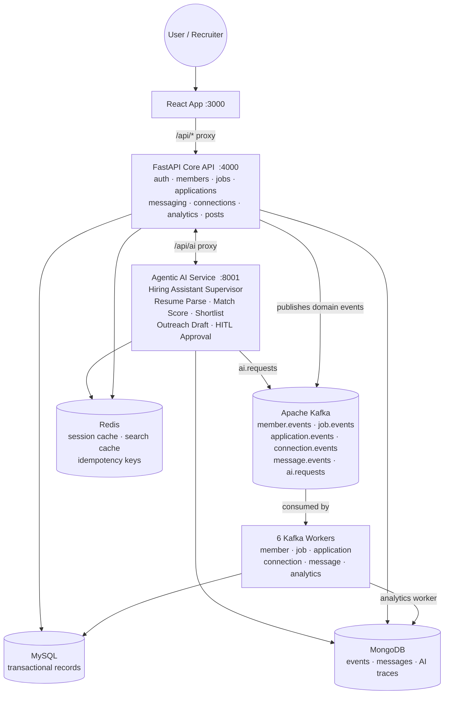
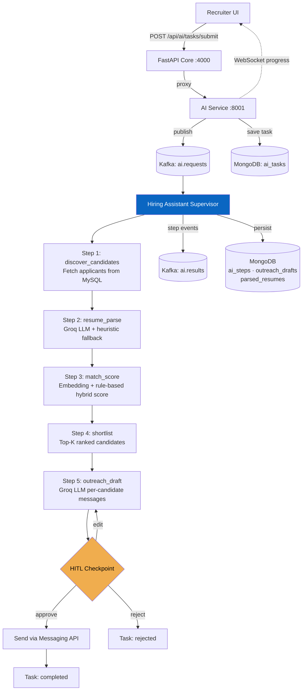

# LinkedIn Simulation — DATA 236 Distributed Systems (SJSU)

A distributed LinkedIn-style platform built with React, FastAPI, Kafka, MySQL, MongoDB, and Redis. Includes a fully agentic AI Hiring Assistant with multi-step pipeline, HITL approval workflow, and WebSocket real-time progress.

---

## 0.0 System Architecture



---

### 0.0.1 AI Agentic Workflow



---

### 0.0.2 Data Layer — What Goes Where

| Store | Collections / Tables | Used for |
|-------|---------------------|----------|
| **MySQL** | `members`, `auth_users`, `auth_sessions`, `recruiters`, `jobs`, `applications`, `connections`, `connection_requests`, `notifications`, `posts`, `post_likes`, `post_comments`, `post_reposts`, `threads`, `message_threads_members` | All transactional relational records |
| **MongoDB** | `messages` | Message body payloads (unstructured, variable length) |
| **MongoDB** | `events` | Analytics events from all Kafka topics + `/events/ingest` API |
| **MongoDB** | `ai_tasks` | AI task state machine docs (queued → processing → awaiting_approval → completed) |
| **MongoDB** | `ai_task_events` | Append-only event log per task (observability) |
| **MongoDB** | `ai_steps` | One doc per pipeline step — input, output, timing |
| **MongoDB** | `outreach_drafts` | Recruiter outreach drafts with approval status |
| **MongoDB** | `parsed_resumes` | Cached parsed resume results per member (avoids Groq re-calls) |
| **Redis** | `session:{hash}` | JWT session cache — auth checks hit Redis before MySQL |
| **Redis** | `job:{id}` | Job detail cache (5 min TTL) |
| **Redis** | `profile:{id}` | Member profile cache (5 min TTL) |
| **Redis** | `search:jobs:{hash}` | Job search result cache (60 s TTL) |
| **Redis** | `ai:embedding:{hash}` | Sentence-transformer embedding cache (1 hr TTL) |
| **Redis** | `idem:{key}` | Kafka idempotency keys (workers + `/events/ingest`) |
| **Redis** | `ai:step:{task}:{step}` | AI step dedup — prevents double-processing on restart |

---

### 0.0.3 Kafka Topics & Consumer Groups

| Topic | Producer | Consumer Group | Worker |
|-------|----------|----------------|--------|
| `member.events` | `/api/members/*` | `member-service-group` | `member_worker.py` |
| `job.events` | `/api/jobs/*` | `job-service-group` | `job_worker.py` |
| `application.events` | `/api/applications/*` | `application-service-group` | `application_worker.py` |
| `connection.events` | `/api/connections/*` | `connection-service-group` | `connection_worker.py` |
| `message.events` | `/api/messages/*` | `message-service-group` | `message_worker.py` |
| `member.events` + `job.events` + `application.events` + `connection.events` + `message.events` | (all above) | `analytics-service-group` | `analytics_worker.py` |
| `ai.requests` | AI service `/ai/tasks/submit` | `ai-service-supervisor` | AI Supervisor consumer thread |
| `ai.results` | AI Supervisor pipeline | (consumed by WebSocket push) | Progress stream |

All Kafka messages follow a **7-field envelope standard**:

```json
{
  "event_type": "application.submitted",
  "trace_id": "uuid",
  "timestamp": "2026-05-04T12:00:00.000Z",
  "actor_id": "M-123",
  "entity": { "entity_type": "application", "entity_id": "A-456" },
  "payload": { "job_id": "J-789", "member_id": "M-123" },
  "idempotency_key": "sha256-hash"
}
```

Envelope validation runs on both publish (`kafka_bus.send_kafka`) and inbound consume (`/events/ingest`). Invalid envelopes are logged and rejected (ingest) or warned (publish — still sent for backward compat).

---

## 0.1 Ports, Gateway, and Swagger

| Port | Service | Used for |
|------|---------|----------|
| **3000** | React app (Vite dev server) | Browser UI · Vite proxies `/api` and `/docs` → `:4000` |
| **4000** | FastAPI Core API | All REST routes · **Swagger at `http://localhost:4000/docs`** |
| **8001** | Agentic AI (FastAPI) | Reached via `:4000` proxy under `/api/ai/*` |
| 3306 | MySQL | Transactional records (Docker) |
| 27017 | MongoDB | Events, messages, AI task traces (Docker) |
| 6379 | Redis | Cache + idempotency (Docker) |
| 9092 | Kafka | Message broker (Docker) |
| 2181 | Zookeeper | Kafka coordinator (Docker) |

**Takeaways:**
- Swagger (canonical) → `http://localhost:4000/docs`
- Swagger (via Vite proxy) → `http://localhost:3000/docs` when `npm run dev` is running
- AI service docs → `http://localhost:8001/docs`

---

## 0.2 TL;DR — copy/paste to get running

**First time only (one-time setup):**

```bash
# Terminal 1 — from repo root
npm run bootstrap
npm run bootstrap:python
npm run bootstrap:ai-service
docker compose up -d
npm run start:all
```

```bash
# Terminal 2 — React UI
cd frontend
npm run dev
```

Open **[http://localhost:3000](http://localhost:3000)**. Sign in with `admin@test.com` / `admin123`.

**Daily (after initial setup):**

```bash
# Terminal 1
docker compose up -d
npm run start:all

# Terminal 2
cd frontend && npm run dev
```

---

## 1.0 Prerequisites

Install these before anything else:

1. **Node.js 20+** and npm — [https://nodejs.org](https://nodejs.org)
2. **Docker Desktop** (includes Docker Compose) — [https://www.docker.com/products/docker-desktop](https://www.docker.com/products/docker-desktop)
3. **Python 3.10+** — [https://www.python.org/downloads](https://www.python.org/downloads)

Verify:

```bash
node --version    # should print v20.x or higher
docker --version  # should print Docker version 24+
python3 --version # should print Python 3.10+
```

---

## 2.0 First-Time Setup (New Teammate)

Run all commands from the **repo root** (the folder that contains `package.json` and `frontend/`).

### 2.1 Install all dependencies

```bash
npm run bootstrap            # installs Node deps for frontend/
npm run bootstrap:python     # creates backend/.venv and pip-installs FastAPI stack
npm run bootstrap:ai-service # creates services/ai-service/.venv and pip-installs AI stack
```

> **Note:** `bootstrap:python` and `bootstrap:ai-service` each create a separate virtual environment so the FastAPI core and the AI service stay isolated. You only need to run these once per machine.

### 2.2 Start infrastructure (databases + Kafka + Redis)

Make sure **Docker Desktop is running** first, then:

```bash
docker compose up -d
```

This starts five containers:

| Container | Port | What |
|-----------|------|------|
| Zookeeper | 2181 | Kafka coordinator |
| Kafka | 9092 | Message broker |
| MySQL | 3307 (host) → 3306 (container) | Relational DB |
| MongoDB | 27017 | Events, messages, AI traces |
| Redis | 6379 | Cache + idempotency |

> **If you see `Cannot connect to the Docker daemon`:** Start Docker Desktop first, then re-run `docker compose up -d`.

> **If Kafka shows `ECONNREFUSED 127.0.0.1:9092`:** Docker hasn't finished starting yet. Wait 10–15 seconds and retry.

### 2.2.1 Optional: run the full app stack in Docker (for AWS/ECS images)

After infra is up, you can also build and run the backend + AI service in Docker:

```bash
docker compose -f docker-compose.yml -f docker-compose.apps.yml up -d --build
```

Then still run the React UI on the host with `cd frontend && npm run dev` (proxies to `localhost:4000`). For EKS/ECS, see `deploy/kubernetes/` and `deploy/aws-ecs/`.

### 2.3 Start all backend services

```bash
npm run start:all
```

This single command starts **three things** together:

1. **FastAPI Core API** on `:4000` — all REST routes (`/api/*`), Swagger at `/docs`
2. **6 Kafka worker coroutines** — member, job, application, connection, message, analytics (all run in one `asyncio.gather` process)
3. **Agentic AI FastAPI** on `:8001` — hiring assistant supervisor, skills, HITL approval

> **Leave Terminal 1 running.** If you close it, the API and workers stop.

If you want to run each part separately (for debugging):

```bash
npm run dev:api-python    # FastAPI only on :4000
npm run dev:workers-python # Kafka workers only
npm run dev:ai-service    # AI service only on :8001
```

### 2.4 Start the React UI (Terminal 2)

```bash
cd frontend
npm run dev
```

Vite starts on **[http://localhost:3000](http://localhost:3000)** and automatically proxies all `/api/*` and `/docs` requests to FastAPI on `:4000`.

> If port `3000` is busy, Vite picks the next free port and prints it in the terminal — open that URL instead.

### 2.5 Open the app

| URL | What |
|-----|------|
| **[http://localhost:3000](http://localhost:3000)** | React app (main entry point) |
| [http://localhost:3000/login/email](http://localhost:3000/login/email) | Sign in |
| [http://localhost:3000/signup](http://localhost:3000/signup) | Create account |
| [http://localhost:3000/feed](http://localhost:3000/feed) | Post-login feed |
| **[http://localhost:4000/docs](http://localhost:4000/docs)** | **Swagger UI (canonical — FastAPI direct)** |
| [http://localhost:3000/docs](http://localhost:3000/docs) | Swagger via Vite proxy (same content) |
| [http://localhost:8001/docs](http://localhost:8001/docs) | AI service Swagger (when running) |

> **Swagger lives on FastAPI (:4000), not on the Vite dev server (:3000).** Both URLs above show identical content because Vite proxies `/docs`.

### 2.6 Load demo data (optional but recommended)

After `npm run start:all` is running:

```bash
npm run seed:demo-jobs        # 15 Bay Area job postings — safe to re-run
npm run seed:connections      # demo member graph for M-123
npm run seed:ai-applicants    # demo applicants for AI pipeline testing
```

Or load the full SQL snapshot (replaces tables with a realistic dataset):

```bash
npm run seed:full-sql
```

This is equivalent to:

```bash
docker exec -i linkedin-mysql mysql -ulinkedin_user -plinkedin_pass linkedin_db < scripts/seed-full-db.sql
```

> **Warning:** `seed:full-sql` overwrites the listed MySQL tables. Do not run against a DB you need to keep without a backup.

### 2.7 Sanity check

```bash
npm run test:smoke
```

The smoke test hits `http://localhost:4000/api` directly (not Vite) and validates core endpoints, Kafka worker persistence, analytics ingest, and messaging round-trip.

---

## 3.0 Default Test Login

FastAPI **auto-creates** the admin account on every startup (safe to re-run):

| Field | Value |
|-------|-------|
| Email | `admin@test.com` |
| Password | `admin123` |

Sign in at [http://localhost:3000/login/email](http://localhost:3000/login/email), then open [http://localhost:3000/feed](http://localhost:3000/feed).

**If login fails:**
1. Confirm `npm run start:all` is running (FastAPI must be on `:4000`).
2. After `docker compose up -d`, wait ~15 seconds for MySQL to be ready, then restart `npm run start:all`.
3. Or create a new account at [http://localhost:3000/signup](http://localhost:3000/signup).

---

## 4.0 Auth APIs (JWT + Redis Session Cache)

| Endpoint | Method | Description |
|----------|--------|-------------|
| `/api/auth/signup` | POST | Register → JWT + MySQL session + Redis cache |
| `/api/auth/login` | POST | Login → JWT + MySQL session + Redis cache |
| `/api/auth/me` | GET | `Authorization: Bearer <token>` — Redis-first session check |
| `/api/auth/logout` | POST | Deletes MySQL session + evicts Redis session cache |

Sessions are cached in Redis (`session:{sha256(token)[:32]}`, TTL 3600 s). On every authenticated request the system checks Redis first — MySQL is only hit on a cache miss.

---

## 5.0 Agentic AI Service

### 5.1 Key Endpoints

| Endpoint | Method | Description |
|----------|--------|-------------|
| `/api/ai/tasks/submit` | POST | Submit a new AI task (queues + triggers pipeline) |
| `/api/ai/agent/shortlist` | POST | Alias for `tasks/submit` with `task_type=candidate_shortlist` |
| `/api/ai/tasks/{task_id}` | GET | Get full task state + steps + result |
| `/api/ai/tasks/{task_id}/events` | GET | Append-only event log for the task |
| `/api/ai/tasks/{task_id}/approve` | POST | HITL decision: `approve`, `edit`, or `reject` |
| `/api/ai/tasks` | GET | List all tasks (filter by `actor_id`) |
| `/api/ai/resume/parse` | POST | Parse a resume (Groq LLM + heuristic + cache) |
| `/api/ai/match/score` | POST | Score one candidate against a job |
| `/api/ai/shortlist` | POST | Rank a scored candidate list |
| `/api/ai/outreach/draft` | POST | Generate per-candidate outreach messages |
| `/api/ai/career-coach/suggest` | POST | Personalized career coaching tips |
| `/api/ai/metrics/summary` | GET | Approval outcomes + shortlist quality metrics |
| `/ws/ai/tasks/{task_id}` | WS | Real-time task progress stream |
| `/api/ai/health` | GET | AI service health check |

### 5.2 Submit a Candidate Shortlist Task

```bash
curl -X POST http://localhost:4000/api/ai/tasks/submit \
  -H "Content-Type: application/json" \
  -d '{
    "task_type": "candidate_shortlist",
    "job_id": "J-LIVE-1",
    "candidate_ids": [],
    "actor_id": "R-101",
    "trace_id": "demo-trace-001"
  }'
```

Empty `candidate_ids` → supervisor auto-fetches applicants from MySQL via `/api/applications/byJob`.

### 5.3 Task State Machine

```
queued → processing → awaiting_approval → completed
              ↓                         ↘ rejected
           failed
```

### 5.4 Pipeline Steps (candidate_shortlist)

| Step | What it does |
|------|-------------|
| `discover_candidates` | Fetch applicants from MySQL via REST API |
| `resume_parse` | Parse resumes with Groq LLM (cached in MongoDB `parsed_resumes`) |
| `match_score` | Hybrid score: 40% sentence-transformer embedding + 60% rule score (skills, location, seniority, industry) |
| `shortlist` | Rank by score, take top-K |
| `outreach_draft` | Groq LLM writes per-candidate outreach messages (stored in `outreach_drafts`) |

### 5.5 HITL Approval

```bash
curl -X POST http://localhost:4000/api/ai/tasks/{task_id}/approve \
  -H "Content-Type: application/json" \
  -d '{ "decision": "approve", "reviewer_id": "R-101" }'
```

On `approve`: opens a messaging thread and sends the outreach message to each candidate via the messaging API.

---

## 6.0 Analytics

### 6.1 Endpoints

| Endpoint | Method | Description |
|----------|--------|-------------|
| `/api/events/ingest` | POST | Ingest any analytics event (Kafka envelope required) |
| `/api/analytics/jobs/top` | POST | Top/bottom jobs by applications, clicks, or saves |
| `/api/analytics/jobs/timeseries` | POST | Daily/weekly trend for any event type |
| `/api/analytics/funnel` | POST | View → Save → Apply Start → Submit funnel per job |
| `/api/analytics/geo` | POST | Applicant city distribution + monthly breakdown |
| `/api/analytics/member/dashboard` | POST | Profile views (30d total + daily series), post impressions, search appearances, application status counts |
| `/api/analytics/member/recordProfileView` | POST | Record a `profile.viewed` event to MongoDB |

### 6.2 apply.start Funnel Event

When a member opens the apply page for a job they haven't yet applied to, the frontend automatically fires a `POST /api/events/ingest` with `event_type: "apply.start"`. This populates step 3 of the recruiter's application funnel chart. Idempotency key: `apply-start:{jobId}:{memberId}:{today}`.

### 6.3 Analytics Data Flow

```
Kafka domain events → analytics_worker → MongoDB events collection
POST /events/ingest → MongoDB events collection
Frontend triggers → POST /analytics/* → MongoDB aggregation + MySQL joins
```

---

## 7.0 Main Frontend Routes

| Route | Description |
|-------|-------------|
| `/` | Public landing |
| `/login/email` | Sign in |
| `/signup` | Sign up |
| `/feed` | Post-login feed |
| `/profile` | Own profile |
| `/profile/:memberId` | Public member profile |
| `/jobs` | Jobs home |
| `/jobs/search-results` | Job search + filters |
| `/jobs/apply` | Application form (fires `apply.start` event) |
| `/jobs/tracker` | Application tracker |
| `/applications` | My applications / recruiter review |
| `/messaging` | Messaging inbox |
| `/network` | Connections |
| `/notifications` | Notification center |
| `/recruiter` | Recruiter analytics dashboard |
| `/recruiter/admin` | Recruiter admin panel |
| `/analytics` | Member analytics (profile views, daily chart, application statuses) |

---

## 8.0 Smoke Test & Automated Tests

```bash
# Smoke test (needs npm run start:all + docker compose up -d)
chmod +x scripts/smoke-test.sh
./scripts/smoke-test.sh

# Clean up smoke data
npm run cleanup:smoke

# Pytest (unit)
npm run test:backend

# Pytest (integration — needs full stack running)
npm run test:backend:integration
```

---

## 9.0 Troubleshooting

1. **Profile M-123 missing** — run `npm run start:all` once to trigger FastAPI schema init.
2. **Kafka ECONNREFUSED** — `docker compose up -d` first, then restart `npm run start:all`.
3. **Login fails after infra restart** — stop and restart `npm run start:all` so FastAPI reconnects to MySQL.
4. **Swagger 404** — confirm `http://localhost:4000/docs` directly (FastAPI must be running).
5. **Worker not processing events** — check that Kafka is up (`docker compose ps`) and workers started (`npm run start:all` output shows all 6 consumers).
6. **AI task stuck in `queued`** — AI service on `:8001` may be down. Check `http://localhost:8001/health`. Restart with `npm run dev:ai-service`.
7. **Port conflicts** — `lsof -nP -iTCP -sTCP:LISTEN | grep -E ':(3000|4000|8001)\b'`
8. **Corrupted DB state** — `docker compose down -v && docker compose up -d` (destructive — resets all volumes).

---

## 10.0 Project Structure

```
.
├── frontend/                  # React + TypeScript (Vite, Tailwind, Recharts)
│   └── src/pages/             # MemberAnalyticsPage, RecruiterDashboard, JobApplyPage …
├── backend/
│   ├── app/
│   │   ├── routers/           # members, jobs, applications, messaging, connections,
│   │   │                      # analytics, posts — all FastAPI route handlers
│   │   ├── workers/           # member, job, application, connection, message,
│   │   │                      # analytics workers + run_all.py
│   │   ├── kafka_bus.py       # async Kafka producer + envelope validation
│   │   ├── kafka_envelope.py  # 7-field envelope schema + validator
│   │   ├── auth_utils.py      # JWT, session helpers, Redis session cache
│   │   ├── mongo_db.py        # Motor async client + index init
│   │   ├── redis_client.py    # aioredis client
│   │   ├── idempotency.py     # Redis-backed idempotency helpers
│   │   └── schema_init.py     # MySQL schema + secondary index migrations
├── services/ai-service/
│   └── main.py                # Agentic AI FastAPI service (all-in-one)
├── docker/                    # Docker init scripts
├── deploy/                    # Kubernetes + ECS deployment configs
├── scripts/                   # seed-demo-jobs, seed-connections, smoke-test
├── docs/                      # RUBRIC_ALIGNMENT.md, swagger.yaml
└── docker-compose.yml         # Zookeeper, Kafka, MySQL, MongoDB, Redis
```

