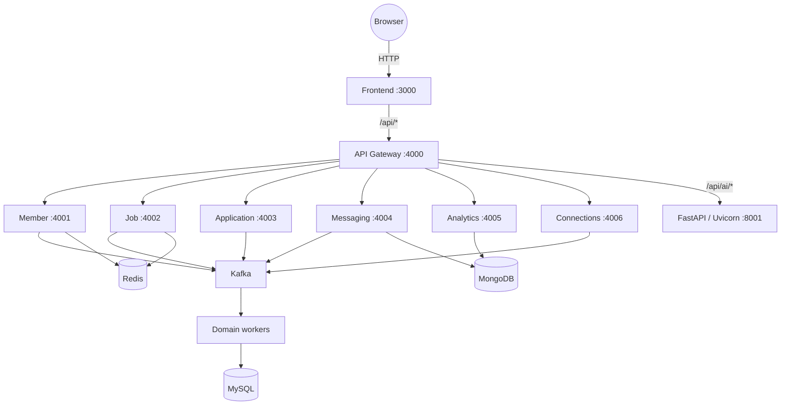

# LinkedIn Simulation: Event-Driven Microservices Architecture

Distributed LinkedIn-style stack for **Data 236**: React UI → **API Gateway** → Node microservices + **FastAPI (Uvicorn)** → **Kafka** → workers → **MySQL**, **MongoDB**, **Redis**.

---

## System architecture



---

## Tech stack

| Layer | Technologies |
| :--- | :--- |
| **Frontend** | React, TypeScript, Vite, Tailwind CSS |
| **Gateway & services** | Node.js (Express) on **4000–4006** |
| **AI service** | **FastAPI** served by **Uvicorn** on **8001** (Python) |
| **Messaging** | Apache Kafka + Zookeeper |
| **Data** | MySQL (transactional), MongoDB (events + messages), Redis (cache + idempotency) |
| **Docs** | Swagger UI at **`http://localhost:4000/docs`** |

---

## Fresh clone — what a new teammate runs (and how often)

Anyone who **clones the full repo** should follow this. You do **not** repeat every step every day—only the parts in **“Each dev session”** when you sit down to code.

| When | What to run | Why |
| :--- | :--- | :--- |
| **Once after `git clone`** | From **repo root**: `npm run bootstrap` | Installs Node deps in `shared`, `api-gateway`, `frontend`, and each `services/*` package. |
| **Once per machine (Python AI)** | `cd services/ai-service && python3 -m pip install -r requirements.txt` | FastAPI / Uvicorn + optional Kafka client. |
| **When Docker data is empty / first time / after `docker compose down -v`** | `docker compose up -d` then (with stack up) `npm run seed:member` | Creates DB volumes and demo member **M-123** for the Profile page. |
| **Each dev session** (typical) | `docker compose up -d` (if containers were stopped) → `npm run start:all` → in another terminal `cd frontend && npm run dev` | Brings infra + Node services + UI online. **No seed** unless the DB was wiped. |
| **When using AI through the gateway** | `cd services/ai-service && python3 -m uvicorn main:app --host 127.0.0.1 --port 8001` | Separate process; start when you need `/api/ai/*`. |

**Summary:** **Bootstrap + pip** = once per clone. **Seed** = once per **empty** MySQL (or after volume wipe). **Docker + start:all + frontend** = each time you work (if things were stopped).

---

## Run everything from VS Code

1. **File → Open Folder…** and choose the **`LinkedIn Simulation`** repo (the folder that contains `package.json`).
2. **Terminal → Run Task…** (or `Cmd+Shift+B` / Command Palette: **Tasks: Run Task**).
3. Run in order (each opens or reuses the integrated terminal):
   - **1. Docker: Compose Up**
   - Wait ~15s for MySQL, then **4. npm: Start all services** (leave this terminal running).
   - **5. Frontend: Vite dev** (second terminal, leave running).
   - Optional: **6. AI: Uvicorn** for `/api/ai/*`.
   - Once logs show the member worker is up: **7. Seed: Demo member M-123** (only when DB is empty / first time).

**Docker:** You can also install the **Docker** extension and use the **Containers** view instead of the CLI task.

---

## Prerequisites

- **Docker** (for Kafka, Zookeeper, MySQL, MongoDB, Redis)
- **Node.js** (v18+ recommended)
- **Python 3** with **FastAPI / Uvicorn** (for the AI microservice)

**After clone**, from repo root:

```bash
npm run bootstrap
```

Install Python deps for AI once:

```bash
cd services/ai-service
python3 -m pip install -r requirements.txt
```

(Equivalent to the old manual loop: `cd shared && npm install`, `cd api-gateway && npm install`, `cd frontend && npm install`, plus each service folder.)

---

## Quick start (recommended order)

1. **Open a terminal in the project folder** (the repo root — the folder that contains `package.json`, not only `shared/`):

   ```bash
   cd ~/Desktop/"LinkedIn Simulation"
   ```

2. **Infra:** `docker compose up -d`  
   If you see **container name conflicts**, stop old containers: `docker compose down` or `docker rm -f linkedin-zookeeper linkedin-kafka linkedin-mysql linkedin-mongo linkedin-redis`, then run `docker compose up -d` again.

3. **Node services (gateway + APIs + workers):** from that same **root** folder:

   ```bash
   npm run start:all
   ```

3b. **Demo profile (`M-123`)** for the Profile page (Kafka + member **worker** must be running so the event is written to MySQL):

   ```bash
   npm run seed:member
   ```

   Wait a few seconds, then open **http://localhost:3000/profile** (or refresh).

4. **Frontend** (new terminal). Run **`npm install` on its own line** (do not put `#` on the same line — npm can treat it as a package name and fail with `EINVALIDTAGNAME`):

   ```bash
   cd ~/Desktop/"LinkedIn Simulation"/frontend
   npm install
   npm run dev
   ```

   Then open **http://localhost:3000**

5. **AI / Uvicorn** (optional, new terminal): `cd services/ai-service && python3 -m uvicorn main:app --host 127.0.0.1 --port 8001` → gateway **`/api/ai/*`** works.

**Note:** `npm run start:all` is defined in the **root** `package.json`. If you are inside `shared/`, you can run `npm run start:all` there too — it forwards to the root script — but the clearest approach is always **`cd` to the repo root** first.

### Troubleshooting: Profile / gateway **504** (timeout)

Common causes:

1. **Member API never bound to port 4001** because it used to **wait for MySQL `CREATE TABLE`** before `listen()`. If MySQL was slow, the gateway timed out. **Fixed:** member (and connection) services **listen immediately**, then create tables in the background. **MySQL pool** now has **`connectTimeout: 15s`** so bad TCP fails fast.
2. **Redis** blocking reads — **fixed:** `/members/get` skips cache if Redis errors; Redis client has a **3s connect timeout**.

**What you should do:** `docker compose up -d`, wait **~10–15s** for MySQL to accept connections, then `npm run start:all`. In logs you should see **`member-service API running on port 4001`**. Then **`npm run seed:member`** if profile **M-123** is missing.

**macOS tip:** The repo defaults to **`127.0.0.1`** (not `localhost`) for MySQL, Redis, Kafka, Mongo, and gateway upstreams — this avoids **IPv6 `::1` ↔ Docker** stalls that show up as **504** in the browser.

### Troubleshooting: MySQL `ER_ACCESS_DENIED` for `linkedin_user` (workers / services)

**Two common causes:**

1. **Homebrew MySQL vs Docker (macOS)** — If **`lsof -nP -iTCP:3306 -sTCP:LISTEN`** shows **both** `com.docke` and **`mysqld`**, Node often hits **Homebrew** on `127.0.0.1`, where `linkedin_user` does not exist. **Fix:** `brew services stop mysql` (or `mariadb`). Only Docker should serve **3306** for this project unless you intentionally reconfigure ports.

2. **Stale Docker volume** — If even **`docker exec … mysql -u root -proot`** fails inside **`linkedin-mysql`**, the data directory was initialized with **old** passwords. **Fix:** from the repo root, `docker compose down -v && docker compose up -d` (this **deletes** MySQL + Mongo data in compose volumes; you’ll need **`npm run seed:member`** again).

### Demo jobs (Jobs page / Easy Apply)

The **Jobs** UI reads **open** jobs from MySQL. After a **fresh DB** or **`docker compose down -v`**, the list is empty — that’s expected.

With **`npm run start:all`** running (Kafka + **job worker** up), create one job from the repo root:

```bash
curl -s -X POST http://localhost:4000/api/jobs/create \
  -H "Content-Type: application/json" \
  -d '{"title":"Senior Software Engineer","company":"Acme","location":"San Jose, CA","salary":"$150k–$200k","type":"Full-time","skills":["React","Kafka"],"description":"Distributed systems role.","recruiter_id":"R-123"}'
```

Wait **~5–15s**, then open **http://localhost:3000/jobs**. Equivalent: **Swagger** at **http://localhost:4000/docs** → **`POST /api/jobs/create`**. You do **not** need to repeat this on every dev session — only when there are no jobs in the DB.

### Troubleshooting: `npm error EINVALIDTAGNAME` / package `"#"`

That usually means **`npm install` was run with `#` as an argument** (often from copy-pasting a comment on the same line, e.g. `npm install # once`). **Fix:** run only:

```bash
npm install
```

If **`npm run dev`** already shows **VITE … ready** and **http://localhost:3000**, you can ignore the failed install line and use the app; run a clean **`npm install`** next time you add dependencies.

---

## 1. Start infrastructure

```bash
docker compose up -d
```

---

## 2. Start application processes

You have **two options**.

### Option A — one command for Node services (no Uvicorn)

From the **repo root** (folder containing `package.json`):

```bash
npm run start:all
```

This runs **all** `dev:*` scripts (gateway, member + job + application API/workers, messaging, analytics, connection, etc.). It does **not** start the **Python AI** server or the **Vite** frontend.

### Option B — manual tabs (full picture)

| What | Command | Port |
| :--- | :--- | :---: |
| **API Gateway** | `cd api-gateway && npm run start` | **4000** |
| **Frontend (Vite)** | `cd frontend && npm run dev` | **3000** |
| **Member API** | `cd services/member-service && node api.js` | **4001** |
| **Member worker** | `cd services/member-service && node worker.js` | — |
| **Job API** | `cd services/job-service && node api.js` | **4002** |
| **Job worker** | `cd services/job-service && node worker.js` | — |
| **Application API** | `cd services/application-service && node api.js` | **4003** |
| **Application worker** | `cd services/application-service && node worker.js` | — |
| **Messaging** | `cd services/messaging-service && npm run start:api` | **4004** |
| **Analytics** | `cd services/analytics-service && npm run start:api` | **4005** |
| **Connections** | `cd services/connection-service && node api.js` | **4006** |
| **Agentic AI (FastAPI)** | `cd services/ai-service && python3 -m uvicorn main:app --host 127.0.0.1 --port 8001` | **8001** |

**Swagger UI:** [http://localhost:4000/docs](http://localhost:4000/docs)  
**Frontend:** [http://localhost:3000](http://localhost:3000)

---

## Why Uvicorn?

The **course requires the Agentic AI layer in FastAPI**. That stack is started with **Uvicorn** (ASGI server), e.g.:

```bash
cd services/ai-service
python3 -m uvicorn main:app --reload --host 127.0.0.1 --port 8001
```

The gateway proxies **`/api/ai/*`** → **`http://localhost:8001/ai/*`**, and **WebSockets** `ws://localhost:4000/api/ai/ws/...` → **`ws://localhost:8001/ws/...`**. If Uvicorn is not running, AI routes through the gateway will fail until you start it.

**Two Swagger UIs (same AI contract):**

| URL | What it is |
| :--- | :--- |
| **http://localhost:4000/docs** | Full system API; **Try it out** hits the gateway (`/api/...`). Agentic AI paths are **`/ai/...`** under the `servers` base URL `http://localhost:4000/api`. |
| **http://localhost:8001/docs** | FastAPI only — same **`/ai/...`** routes, no `/api` prefix. |

If those two lists **differ**, refresh **:4000/docs** (hard refresh) and ensure you saved the latest **`api-gateway/swagger.yaml`**. They should list the same **HTTP methods** for each **`/ai/*`** path.

---

## Features (high level)

- **Gateway + OpenAPI** — Single entry and **`/docs`** for all domains.
- **Members, Jobs, Applications** — CRUD-style flows, Kafka workers, Redis where designed.
- **Messaging** — Threads (MySQL) + message bodies (MongoDB).
- **Analytics** — Event ingest + dashboard-style endpoints (Mongo + SQL).
- **Connections** — Requests, accept/reject, list, mutual connections.
- **AI service** — FastAPI endpoints + optional WebSocket; Kafka hook for `ai.requests`.

---

## Project docs

- **`PROJECT_STATUS.md`** — What is implemented vs left for benchmarks / AWS / CI.
- **Seed profile** — Run member seed if needed: `node services/member-service/seed.js` (requires Kafka up).

---

*Data 236 — Distributed Systems — LinkedIn Simulation + Agentic AI.*

---

## Non-AI completion runbook

Use this sequence for the full frontend + backend (AI deferred) pass:

1. `docker compose up -d`
2. `npm run start:all`
3. In another terminal: `cd frontend && npm run dev`
4. Optional seed profile: `npm run seed:member`

Core UI routes:

- `/` home shell
- `/profile` member profile + analytics card
- `/jobs` job search/filter/get/apply/save
- `/applications` member applications + recruiter review actions
- `/messaging` threads/messages/send
- `/network` requests/accept/reject/list
- `/recruiter` live recruiter analytics charts

Smoke test:

```bash
chmod +x scripts/smoke-test.sh
./scripts/smoke-test.sh
```

Additional closeout docs:

- `DATASET_PIPELINE.md` — datasets + schema mapping + ingestion strategy
- `SUBMISSION_ARTIFACTS_CHECKLIST.md` — final report/demo checklist
