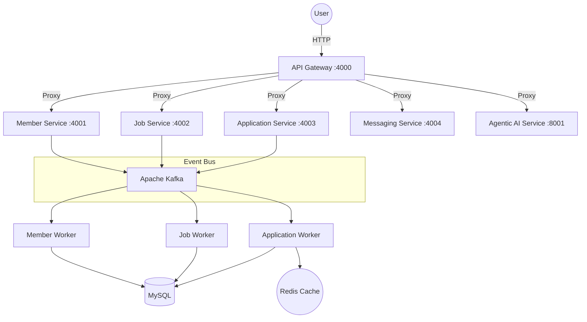

# LinkedIn Simulation: Event-Driven Microservices Architecture

A high-performance, distributed simulation of the LinkedIn platform, built using an event-driven microservices architecture. This project demonstrates scalability, service decoupling, and polyglot persistence (MySQL + MongoDB + Redis) along with an Agentic AI layer.

---

## 🏗 System Architecture



---

## 🛠 Tech Stack

| Layer | Technologies |
| :--- | :--- |
| **Frontend** | React, TypeScript, Tailwind CSS, Lucide Icons |
| **Backend** | Node.js (Express), FastAPI (Python) |
| **Messaging** | Apache Kafka, Zookeeper |
| **Persistence** | MySQL (Relational), MongoDB (Document/Analytics), Redis (Caching) |
| **Documentation** | Swagger / OpenAPI 3.0 |

---

## 🚦 Getting Started

### 1. Prerequisite Infrastructure
Ensure you have Docker running, then start the core infrastructure:
```bash
docker-compose up -d
```

### 2. Microservices Orchestration
Start the following components in separate terminal tabs:

| Service | Command | Port |
| :--- | :--- | :--- |
| **API Gateway** | `cd api-gateway && node index.js` | 4000 |
| **Frontend** | `cd frontend && npm run dev` | 3000 |
| **Member Service** | `cd services/member-service && node api.js` | 4001 |
| **Job Service** | `cd services/job-service && node api.js` | 4002 |
| **Application Svc** | `cd services/application-service && node api.js` | 4003 |

*(Workers for each service should also be running for background persistence).*

---

## 🚀 Active Features

- **Centralized API Docs**: Fully documented endpoints at `/docs` using Swagger UI.
- **Dynamic Profile Service**: Real user data management (Sneha Singh profile at `M-123`).
- **Jobs Board**: Real-time filtering and creation of job postings.
- **Easy Apply**: One-click job application flow processed asynchronously via Kafka.
- **Relational Persistence**: All core entities stored in structured MySQL tables.

---

## 📖 API Documentation (Swagger)

The project includes a centralized Swagger UI for testing all microservices. 

1. Start the **API Gateway** (`node index.js`).
2. Navigate to: **`http://localhost:4000/docs`**
3. Here you can find the OpenAPI 3.0 definitions for all 5 domains (Members, Jobs, Applications, Messaging, and AI).

---

## ⏳ Roadmap
- [ ] **Analytics (MongoDB)**: Tracking user behavior and recruiter metrics.
- [ ] **Agentic AI**: Integration of Python-based LLM career coaching.
- [ ] **Real-time Messaging**: Kafka-backed chat system between members.

---
*Created for the Data 236 Distributed Systems Project.*
