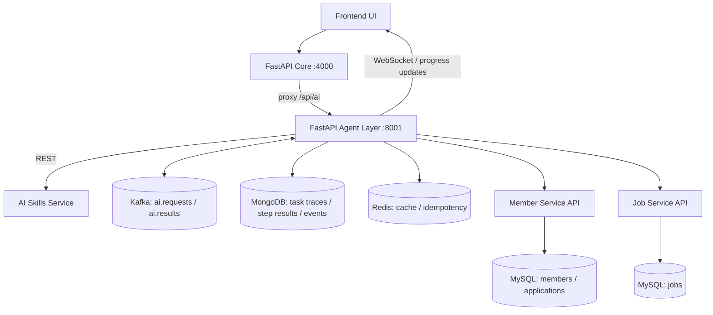
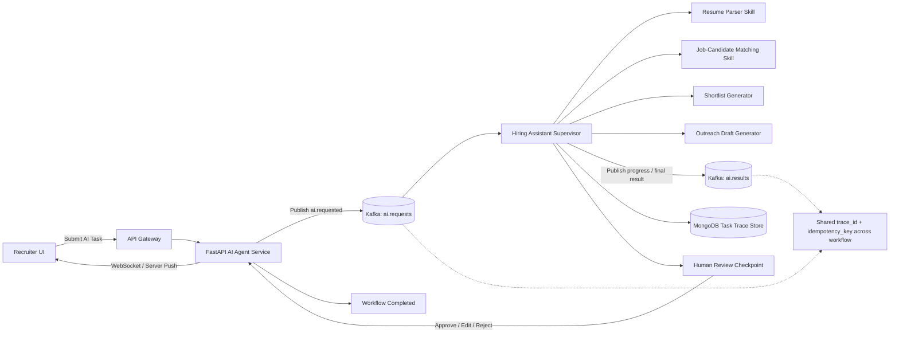

# LinkedIn Simulation (Data 236)

Distributed LinkedIn-style project with React frontend, **FastAPI** core API (port 4000), Python Kafka workers, MySQL, MongoDB, Redis, Agentic AI service, and deployment/benchmarking readiness.

---

<!-- ====================== 0.0 SYSTEM ARCHITECTURE ====================== -->

### 0.0.1 AI Architecture (clean)



---

<!-- ====================== 0.1 PORTS / GATEWAY / SWAGGER ====================== -->
## 0.1 Ports, gateway, and Swagger (read this to avoid confusion)

**This layout is intentional.**

| Port | What it is | You use it for |
|------|------------|----------------|
| **4000** | **FastAPI** core API (single HTTP entry: all domain routes + proxy to AI) | `POST /api/...`, **`http://localhost:4000/docs`** (OpenAPI / Swagger) |
| **8001** | **Agentic AI** (FastAPI) | Used directly by the core API via HTTP/WebSocket proxy under `/api/ai` |
| **3000** | **React app** (Vite dev server) | **`http://localhost:3000`**. Vite **proxies** `/api` and `/docs` → `http://localhost:4000`. |
**Takeaways**

1. **Swagger** is served by **FastAPI** on **`/docs`** (port **4000**). The Vite dev server **forwards** `/docs` when you run `npm run dev` in `frontend/`. A frozen copy of the old gateway OpenAPI YAML is in **`docs/swagger.yaml`** (reference only).
2. **UI** on **3000**, **API** on **4000** (Python). Run **`npm run bootstrap:python`** and **`npm run bootstrap:ai-service`** once, then **`npm run start:all`** (FastAPI + Kafka workers + AI).
3. **`npm run test:smoke`** calls **`http://localhost:4000/api`** on purpose so backend health is checked **without** relying on the Vite dev server.

---

## 0.2 Local workflow (features and correctness)

Use this while you focus on **everything working on your machine**. **AWS/Kubernetes, JMeter, and the performance write-up** are separate milestones (see `deploy/` and the class PDF when you tackle them).

| Step | Command |
|------|---------|
| 1. One-time install | `npm run bootstrap` · `npm run bootstrap:python` · `npm run bootstrap:ai-service` |
| 2. Databases + Kafka + Redis | `docker compose up -d` |
| 3. API + workers + AI | `npm run start:all` (leave running) |
| 4. React UI | `cd frontend && npm run dev` → [http://localhost:3000](http://localhost:3000) |
| 5. Sanity check | `npm run test:smoke` |
| 6. Automated tests | `npm run test:backend` · optional live: `npm run test:backend:integration` |

If something fails, see **§9.0 Troubleshooting**. Feature-to-code mapping: **`docs/RUBRIC_ALIGNMENT.md`**.

---

<!-- ====================== 1.0 PREREQUISITES ====================== -->
## 1.0 Prerequisites

Install these first:

1. Node.js 20+ and npm
2. Docker + Docker Compose
3. Python 3.10+ and pip

---

<!-- ====================== 2.0 FIRST-TIME SETUP ====================== -->
## 2.0 First-Time Setup (New Teammate)

Run from repo root.

### 2.1 Install dependencies

```bash
npm run bootstrap
npm run bootstrap:python
npm run bootstrap:ai-service
```

Notes:
1. `npm run bootstrap` installs Node dependencies for `frontend/`.
2. `npm run bootstrap:python` creates `backend/.venv` and installs the FastAPI stack (`backend/requirements.txt`).
3. `npm run bootstrap:ai-service` creates `services/ai-service/.venv` for the Agentic AI Uvicorn process (`start:all`).

### 2.1.1 Optional: load full demo data from SQL dump (realistic jobs + members)

The repo includes **`scripts/seed-full-db.sql`** (mysqldump of `linkedin_db`). Importing it **replaces** the listed tables (it uses `DROP TABLE` / `CREATE TABLE` / `INSERT`) with the snapshot—use when you want **real-looking job rows** instead of only smoke-test data.

**Requirements:** Docker MySQL container running (`docker compose up -d`), container name **`linkedin-mysql`** (default in this repo).

From repo root:

```bash
npm run seed:full-sql
```

Or without npm:

```bash
docker exec -i linkedin-mysql mysql -ulinkedin_user -plinkedin_pass linkedin_db < scripts/seed-full-db.sql
```

If you have the `mysql` client on the host instead:

```bash
mysql -h 127.0.0.1 -P 3307 -u linkedin_user -plinkedin_pass linkedin_db < scripts/seed-full-db.sql
```

Then **restart** `npm run start:all` so FastAPI reconnects and schema expectations match the loaded data.

**Warning:** This overwrites those MySQL tables for `linkedin_db`. Do not run against a database you need to keep unless you have a backup.

**Heads-up:** `seed-full-db.sql` only ships **two** job rows (smoke-style titles). If you then run **`npm run cleanup:smoke`**, those rows are removed and **`jobs` can be empty**—so `/jobs` shows nothing. Fix by loading realistic postings:

```bash
npm run seed:demo-jobs
```

That runs **`scripts/seed-demo-jobs.sql`** (15 Bay Area–style open roles, `R-123`). Safe to re-run (`ON DUPLICATE KEY UPDATE`).

**Teammate stuck on “Smoke Duplicate Apply Job” or missing job logos?** With Docker MySQL up (`linkedin-mysql` container name unchanged), from repo root run **`npm run jobs:fix-teammate`** — it runs **`cleanup:smoke`** then **`seed:demo-jobs`**. Each laptop uses its own database; this must be run on **her** machine, not yours.

### 2.2 Start infrastructure (DB + broker)

```bash
docker compose up -d
```

Important:
1. Ensure Docker Desktop/daemon is running before this command.
2. If you see `Cannot connect to the Docker daemon` or Kafka `ECONNREFUSED 127.0.0.1:9092`, start Docker first, rerun `docker compose up -d`, then rerun `npm run start:all`.

Infra services started by this command:
1. Zookeeper (`2181`)
2. Kafka (`9092`)
3. MySQL (`3306`)
4. MongoDB (`27017`)
5. Redis (`6379`)

**Demo jobs inside Docker (first MySQL volume only):** On a **new** `mysql-data` volume, the MySQL container runs `docker/mysql/init/` once: it creates the `jobs` table and imports `scripts/seed-demo-jobs.sql` (Bay Area demo roles + `company_logo_url` favicons). If your team already has an old volume, run `npm run seed:demo-jobs` once, or reset data with `docker compose down -v` (destructive) and `docker compose up -d` again.

### 2.2.1 Optional: run API + workers + AI in Docker (rubrics / AWS images)

After infra is up:

```bash
docker compose -f docker-compose.yml -f docker-compose.apps.yml up -d --build
```

This builds `backend/Dockerfile` (FastAPI or workers via `RUN_WORKERS`) and `services/ai-service/Dockerfile`. The React app can still run on the host with `cd frontend && npm run dev` (proxies to `localhost:4000`). For **EKS/ECS**, see `deploy/kubernetes/` and `deploy/aws-ecs/README.md`.

### 2.3 Start backend services

```bash
npm run start:all
```

### 2.4 Start frontend (second terminal)

```bash
cd frontend
npm run dev
```

If port `3000` is already in use, Vite auto-selects another port (for example `3001`). Open the exact Local URL shown in terminal.

### 2.5 Open app and docs

See **§0.1** for why both **4000** and **3000** appear — both are correct for different purposes.

1. App: [http://localhost:3000](http://localhost:3000)
2. Swagger (**canonical** — FastAPI on :4000): [http://localhost:4000/docs](http://localhost:4000/docs)
3. Swagger (**dev convenience** — Vite on 3000 proxies `/docs` to :4000; same content as #2): [http://localhost:3000/docs](http://localhost:3000/docs)

### 2.5.1 Quick access URLs

1. Public home: [http://localhost:3000/](http://localhost:3000/)
2. Sign in: [http://localhost:3000/login/email](http://localhost:3000/login/email)
3. Sign up: [http://localhost:3000/signup](http://localhost:3000/signup)
4. Feed (post-login): [http://localhost:3000/feed](http://localhost:3000/feed)
5. Swagger API docs (FastAPI): [http://localhost:4000/docs](http://localhost:4000/docs)
6. Swagger API docs (via dev server proxy — convenient if you only want to share port `3000`): [http://localhost:3000/docs](http://localhost:3000/docs)
7. AI FastAPI docs (only when AI service is running): [http://localhost:8001/docs](http://localhost:8001/docs)

### 2.6 Exact terminal commands (copy/paste)

1. Terminal 1 (repo root) - install + infrastructure + backend:

```bash
cd "<repo-root>"
npm run bootstrap
pip install -r requirements.txt
docker compose up -d
npm run start:all
```

2. Terminal 2 - frontend:

```bash
cd "<repo-root>/frontend"
npm run dev
```

3. If login or auth flakes after infra restart, stop `npm run start:all` and start it again so FastAPI on :4000 reconnects cleanly to MySQL.

### 2.7 Quick start (same flow, shorter)

Replace `<repo-root>` with your cloned project folder (the directory that contains `package.json` and `frontend/`).

**Terminal 1** (first time) — install deps, start Docker infra, start all backend processes:

```bash
cd <repo-root>
npm run bootstrap
pip install -r requirements.txt
docker compose up -d
npm run start:all
```

**Terminal 1** (daily)

```bash
cd <repo-root>
docker compose up -d
npm run start:all
```

**Terminal 2** — start the React UI

```bash
cd <repo-root>/frontend
npm run dev
```

Note: if `3000` is occupied, Vite will run on the next free port and print it in terminal.

### 2.8 Open and test

1. Browser: [http://localhost:3000](http://localhost:3000) — sign in at `/login/email`, then open `/feed`.
2. API docs (direct on FastAPI): [http://localhost:4000/docs](http://localhost:4000/docs).
3. API docs (proxied — same host as the React app): [http://localhost:3000/docs](http://localhost:3000/docs) when the Vite dev server is running (`npm run dev` in `frontend/`).

`docker compose up -d` starts Zookeeper, Kafka, MySQL, MongoDB, Redis (see **§6.0** for ports).

### 2.9 AI Backend Quickstart (required)

Ports:

1. Core API (FastAPI): `4000`
2. AI service: `8001`

Start (typical — starts API, workers, and AI):

```bash
npm run start:all
```

Or run only the API (after `npm run bootstrap:python`):

```bash
npm run dev:api-python
npm run dev:ai-service
```

Health:

```bash
curl -sS http://127.0.0.1:4000/api/ai/health
```

Submit task (`POST /api/ai/tasks/submit`) — job-first (empty `candidate_ids` loads applicants):

```json
{
  "task_type": "candidate_shortlist",
  "job_id": "J-LIVE-1",
  "candidate_ids": [],
  "actor_id": "R-101",
  "trace_id": "demo-run-001"
}
```

(`recruiter_id` is accepted as an alias of `actor_id`.) After **`shortlist_ready`**, call **`POST /api/ai/tasks/{task_id}/outreach/generate`** with selected `candidate_ids`, then approve. Per-candidate drafts are in **`result.outreach_drafts`**.

Approve task (`POST /api/ai/tasks/{task_id}/approve`):

```json
{
  "decision": "approve",
  "reviewer_id": "R-101"
}
```

Check:

1. `GET /api/ai/tasks/{task_id}`
2. `GET /api/ai/metrics/summary`

Notes:

1. Submit requires **`actor_id` or `recruiter_id`** (recruiter identity).
2. Supported `task_type`: `candidate_shortlist`.
3. Outreach send uses Kafka field **`outreach_by_candidate`** (see `outreach-send-worker.js`).

### 2.9.1 AI Workflow (clean)



---

<!-- ====================== 3.0 TEAM TEST LOGIN ====================== -->
## 3.0 Team Test Login (No Shared DB Needed)

### 3.1 Default admin test account (local only)

The **FastAPI** app runs DB bootstrap on startup: it **auto-creates** the default admin account and **resets the password** for that email (so teammates get the same credentials on a fresh machine).

Use this to sign in at [http://localhost:3000/login/email](http://localhost:3000/login/email):

1. Email: `admin@test.com`
2. Password: `admin123`

After login, open the feed: [http://localhost:3000/feed](http://localhost:3000/feed)

### 3.2 If login fails

1. Confirm **`npm run start:all`** is running (FastAPI API on **:4000**).
2. After `docker compose up -d`, wait for MySQL to be ready, then restart **`npm run start:all`** if login still fails.
3. Or create a new account at [http://localhost:3000/signup](http://localhost:3000/signup).

---

<!-- ====================== 4.0 DAILY STARTUP ====================== -->
## 4.0 Daily Startup (After Initial Setup)

```bash
docker compose up -d
npm run start:all
cd frontend && npm run dev
```

---

<!-- ====================== 5.0 AUTH API (JWT) ====================== -->
## 5.0 Auth APIs (JWT)

1. `POST /api/auth/signup`
2. `POST /api/auth/login`
3. `GET /api/auth/me` (requires `Authorization: Bearer <jwt_token>`)
4. `POST /api/auth/logout`

Auth status: email/password signup/login/logout with JWT bearer tokens.

---

<!-- ====================== 6.0 SERVICES AND PORTS ====================== -->
## 6.0 Services and Ports

**Summary:** see **§0.1**.

1. **Core API (FastAPI):** `:4000` — all REST routes under `/api/*`, **Swagger** at `/docs`.
2. **Agentic AI (FastAPI):** `:8001` — reached via the core API proxy under `/api/ai`.
3. **Frontend (Vite):** `:3000` — proxies `/api` and `/docs` to `http://localhost:4000`.
4. Optional: set **`VITE_API_BASE_URL`** at build time if the UI and API are hosted on different origins (see `frontend/src/main.tsx`).

---

<!-- ====================== 7.0 MAIN ROUTES ====================== -->
## 7.0 Main Non-AI Routes

1. `/`
2. `/login/email`
3. `/signup`
4. `/feed`
5. `/profile`
6. `/jobs`
7. `/applications`
8. `/messaging`
9. `/network`
10. `/notifications`
11. `/recruiter`
12. `/recruiter/admin`

---

<!-- ====================== 8.0 SMOKE TEST ====================== -->
## 8.0 Smoke Test

```bash
chmod +x scripts/smoke-test.sh
./scripts/smoke-test.sh
```

Notes:
1. By default the script calls **`http://localhost:4000/api`** (FastAPI directly), not port `3000`. That validates backends regardless of the Vite proxy.
2. Keep **`npm run start:all`** running so FastAPI, Python workers, and the AI service are up before running smoke.
3. After smoke, **`npm run cleanup:smoke`** (same script the shell step runs) removes from MySQL: known test jobs (**Smoke Duplicate Apply Job**, **Smoke Closed Job**) and related rows, plus **smoke feed posts** (`author_name` **Smoke** and body **`smoke post …`** from `scripts/smoke-test.sh` step [10]), including likes/comments/reposts/sends on those posts. To **skip** the automatic job/post cleanup at the end of smoke, run: `SMOKE_CLEANUP=0 bash scripts/smoke-test.sh`. Anytime later you can still run **`npm run cleanup:smoke`** to delete leftovers.

### 8.1 Automated tests (pytest)

From repo root (after `npm run bootstrap:python`):

```bash
npm run test:backend
```

Integration checks (duplicate signup/application, closed job, health) need the stack running:

```bash
docker compose up -d
npm run start:all
# second terminal:
npm run test:backend:integration
```

Mapping to the class rubric: `docs/RUBRIC_ALIGNMENT.md`.

<!-- ====================== 9.0 TROUBLESHOOTING ====================== -->
## 9.0 Troubleshooting

1. If profile **M-123** is missing, ensure **`npm run start:all`** has run at least once (FastAPI creates baseline schema + member on startup). For extra demo data use **`npm run seed:connections`** or **`npm run seed:ai-applicants`**.
2. If ports are busy, stop old processes and restart `npm run start:all`.
3. If DB state is corrupted, run `docker compose down -v`, then start again.
4. If Swagger is not loading, confirm FastAPI is up on **`http://localhost:4000/docs`**.
5. If auth endpoints return 404, restart **`npm run start:all`** (core API on :4000).
6. If jobs/applications lag after create, confirm **Python Kafka workers** are running (`dev:workers-python` is part of `start:all`) and Kafka is up.
7. Premium page aliases supported: `/premium`, `/try-premium`, `/premium/free-trial`, `/premium/trial`.
8. If Kafka worker logs show `ECONNREFUSED 127.0.0.1:9092`, Docker/Kafka is not up yet. Start Docker, run `docker compose up -d`, then restart `npm run start:all`.
9. If frontend starts on `3001` (or another port), use that printed URL or free `3000` first.
10. If **`RuntimeError: 'cryptography' package is required for sha256_password or caching_sha2_password`**: MySQL 8 uses that auth plugin by default. Reinstall backend deps so **`cryptography`** is present: **`npm run bootstrap:python`** (or `cd backend && .venv/bin/pip install -r requirements.txt`).
11. If **`start:all`** prints **`.venv/bin/python: No such file or directory`** for the AI service: create that venv once with **`npm run bootstrap:ai-service`**.

### 9.1 Additional port/startup diagnostics

```bash
lsof -nP -iTCP -sTCP:LISTEN | grep -E ':(3000|4000|8001)\b'
```

---

<!-- ====================== 10.0 PROJECT STATUS ====================== -->
## 10.0 Project Status

See `PROJECT_STATUS.md` for the consolidated status update.

